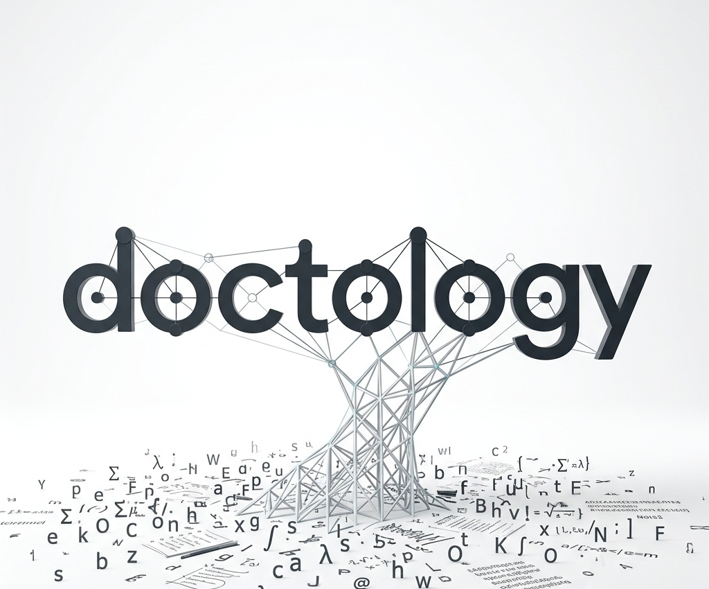

<p align="center">
  
</p>

# DocTology

> 에이전트가 만들고, 사람이 읽고, 결정적 게이트가 지키는 Markdown 지식 시스템.

DocTology는 별도 서버를 운영하는 지식 플랫폼이 아닙니다. 세 가지 에이전트
스킬만으로 **사람이 읽는 LLM Wiki**와 **에이전트가 읽는 Repo Docs**를 만들고
계속 관리합니다. Markdown이 항상 원본이며, SQLite는 필요할 때만 켜는
삭제·재생성 가능한 검색 인덱스입니다.

## 두 가지 사용 방식

| | 사람을 위한 LLM Wiki | 에이전트를 위한 Repo Docs |
| --- | --- | --- |
| 목적 | 자료를 출처·개념·엔티티·프로젝트로 연결해 읽고 탐색 | 코드와 문서, 결정, 계획, 근거의 현재 상태를 명확하게 유지 |
| 링크 | Obsidian `[[wikilink]]` | GitHub·IDE 호환 상대 Markdown 링크 |
| 주요 화면 | `wiki/_meta/index.md`, 연결된 위키 페이지 | `docs/README.md`, 현재 상태, ADR, plan, evidence, repo map |
| 기계 계약 | YAML frontmatter와 coverage receipt | `AGENTS.md`, 상태 frontmatter, validator, 선택적 YAML intelligence |
| 검색 | 선택적 wiki/raw SQLite FTS와 wiki ONNX 벡터 | 파생 SQLite FTS와 Markdown 링크 탐색 |
| 보는 방법 | 일반 Markdown 또는 Obsidian 앱 | GitHub, IDE, 일반 Markdown 도구 |

두 방식은 목적에 따라 링크 문법도 다르게 사용합니다. LLM Wiki는 자유로운
지식 탐색을 위해 wikilink를 쓰고, Repo Docs는 코드·문서의 정확한 경로를
가리키기 위해 표준 Markdown 링크를 씁니다.

## 세 가지 스킬

| Skill | 역할 |
| --- | --- |
| [`llm-wiki-bootstrap`](.agents/skills/llm-wiki-bootstrap/SKILL.md) | `raw/`, `wiki/`, `AGENTS.md`를 갖춘 Obsidian-first 위키를 생성하고 SQLite 사용 여부를 선택합니다. |
| [`llm-wiki-loop`](.agents/skills/llm-wiki-loop/SKILL.md) | raw 원문을 빠짐없이 읽어 기존 개념·엔티티와 연결하고, 스킬 내부의 coverage·procedure·batch 게이트로 위키를 인증합니다. |
| [`repo-docs-intelligence-bootstrap`](.agents/skills/repo-docs-intelligence-bootstrap/SKILL.md) | 코드 저장소에 현재 문서, ADR·plan·evidence, repo map, 에이전트 계약, 검증기를 함께 구축하고 변화에 맞춰 갱신합니다. |

## 가장 쉬운 시작

먼저 세 스킬을 설치하거나 동기화합니다.

```bash
python3 scripts/manage_skills.py check
python3 scripts/manage_skills.py install
```

기본 설치 위치는 `~/.codex/skills`입니다. 다른 위치에는 `--target PATH`,
변경 미리보기에는 `--dry-run`을 사용할 수 있습니다. `SKILL.md`만 따로
복사하지 말고 각 스킬 디렉터리 전체를 사용해야 스크립트와 검증기가 함께
동작합니다.

### 사람이 읽는 위키 만들기

에이전트에게 다음처럼 요청합니다.

```text
llm-wiki-bootstrap 스킬로 ./my-wiki를 만들어줘.
SQLite 사용 여부도 물어봐줘.
```

그다음 생성된 저장소의 `raw/inbox/`에 Markdown 원문을 넣고 요청합니다.

```text
llm-wiki-loop로 raw/inbox의 새 문서를 full coverage로 위키화해줘.
기존 source·concept·entity를 먼저 확인하고 중복 없이 연결한 뒤,
모든 게이트와 finish까지 완료해줘.
```

에이전트는 기존 위키를 먼저 탐색하고, 원문의 heading 또는 bounded chunk를
누락 없이 처리하며, 필요한 기존 페이지를 갱신하거나 재사용 가치가 있는
페이지만 새로 만듭니다. 결과는 Obsidian에서 폴더를 열어 wikilink와 그래프를
바로 탐색할 수 있습니다. Obsidian은 선택 사항이며 모든 결과는 일반
Markdown으로도 읽을 수 있습니다. 게이트 실행 파일은 위키 저장소에 복사되지
않고 `llm-wiki-loop` 스킬 내부에서 `--repo-root`로 실행됩니다.

### 에이전트가 읽는 저장소 문서 만들기

코드 저장소 안에서 다음처럼 요청합니다.

```text
repo-docs-intelligence-bootstrap 스킬로 이 저장소의 현재 구조와 문서를
코드 기준으로 정리하고 검증까지 완료해줘.
```

에이전트는 live code와 테스트를 먼저 확인하고 `AGENTS.md`, 현재 상태,
아키텍처, repo map과 필요한 ADR·plan·evidence를 연결합니다. 검증기는 문서
역할, 상태값, 링크, 변경 영향과 선택적 YAML 계약의 일관성을 확인합니다.

## SQLite는 선택적 가속층

LLM Wiki 부트스트랩에서 직접 선택할 수 있습니다.

```bash
python3 ~/.codex/skills/llm-wiki-bootstrap/scripts/bootstrap_llm_wiki.py \
  /absolute/path/to/wiki --sqlite on

python3 ~/.codex/skills/llm-wiki-bootstrap/scripts/bootstrap_llm_wiki.py \
  /absolute/path/to/wiki --sqlite off
```

`on`이면 두 인덱스가 서로 독립적으로 동작합니다.

- `state/wiki_index.sqlite`: 위키 본문, heading chunk, wikilink와 선택적 로컬 ONNX 벡터
- `state/raw_index.sqlite`: `raw/**/*.md`의 증분 lexical FTS와 원문 byte 위치

기본 검색은 위키 우선입니다. `--raw-fallback`을 명시했을 때만 위키 lexical
결과가 없으면 raw 인덱스를 별도 레인으로 조회합니다. 두 점수는 섞지 않으며,
검색 결과는 항상 해당 Markdown 원문을 다시 열어 확인하는 후보입니다.

LLM Wiki에서 SQLite를 꺼도 Markdown 원본, wikilink와 게이트는 그대로
유지됩니다. Repo Docs의 파생 인덱스 역시 언제든 삭제·재생성할 수 있으며
문서의 진실 여부를 결정하지 않습니다. 인덱싱은 로컬 코드로 결정론적으로
수행되어 별도 LLM 토큰을 소비하지 않습니다.

## 게이트가 보장하는 것

DocTology는 “에이전트가 작성했으니 완료”라고 간주하지 않습니다.

- 일반 위키화 요청은 기본적으로 `full` coverage로 해석
- 원문 heading/chunk별 반영·제외·보류 수량을 receipt로 기록
- 누락된 단계, 오래된 검토, 미반영 원문, writer 충돌을 결정적으로 차단
- loop runtime은 스킬 내부에 한 번만 존재하며 대상 위키에는 run·receipt 결과만 기록
- 위키 변경이 끝나면 선택적 wiki SQLite를 자동 refresh
- Repo Docs는 validator가 현재 문서, 상태, 링크와 변경 영향의 drift를 검사
- 실패한 SQLite 검색 인덱스는 Markdown 완료 상태를 뒤집지 않음

게이트는 절차·구조·coverage를 강하게 보장합니다. 문장의 의미적 정확성과
페이지 통합 판단은 여전히 LLM의 책임이므로, 중요한 주장은 source와 canonical
문서를 다시 열어 검증하도록 계약되어 있습니다.

## 제품 경계

이 저장소가 배포하는 제품은 위 세 스킬뿐입니다. 활성 ontology profile,
canonical JSONL warehouse, GUI workbench 또는 내장 corpus는 없습니다. 더 복잡한
그래프·온톨로지 시스템이 필요해도 Markdown과 현재 스킬의 진실 경계를
대체하지 않는 별도 제품으로 추가하는 것을 원칙으로 합니다.

## 개발 검증

```bash
python3 scripts/manage_skills.py check
python3 -m unittest discover -s tests
```

구조, 데이터 흐름과 유지보수 방법은 [문서 포털](docs/README.md)에서 확인할
수 있습니다.
